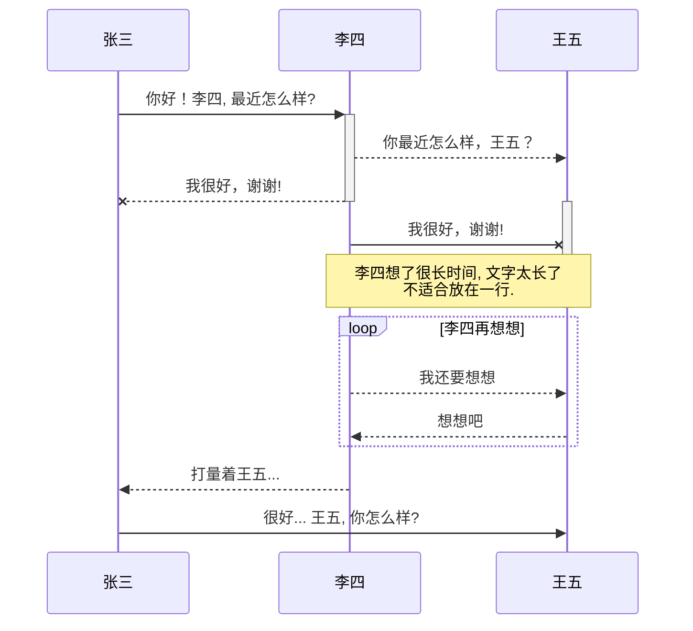

# date

## LocalDateTime使用方法，转换为Date；Date转换为LocalDateTime

基本概念

时刻：所有计算机系统内部都用一个整数表示时刻，这个整数是距离格林尼治标准时间1970年1月1日0时0分0秒的毫秒数，可以理解时刻就是绝对时间，它与时区无关，不同时区对同一时刻的解读，即年月日时分秒是不一样的；

时区：同一时刻，世界上各个地区的时间可能是不一样的，具体时间与时区有关，一共有24个时区，英国格林尼治是0时区，北京是东八区，也就是说格林尼治凌晨1点，北京是早上9点；

年历：我们都知道，中国有公历和农历之分，公历和农历都是年历，不同的年历，一年有多少月，每月有多少天，甚至一天有多少小时，这些可能都是不一样的，我们主要讨论公历。

Java 8中表示日期和时间的类有多个，主要的有：

Instant：表示时刻，不直接对应年月日信息，需要通过时区转换
LocalDateTime: 表示与时区无关的日期和时间信息，不直接对应时刻，需要通过时区转换
LocalDate：表示与时区无关的日期，与LocalDateTime相比，只有日期信息，没有时间信息
LocalTime：表示与时区无关的时间，与LocalDateTime相比，只有时间信息，没有日期信息
ZonedDateTime： 表示特定时区的日期和时间
ZoneId/ZoneOffset：表示时区

