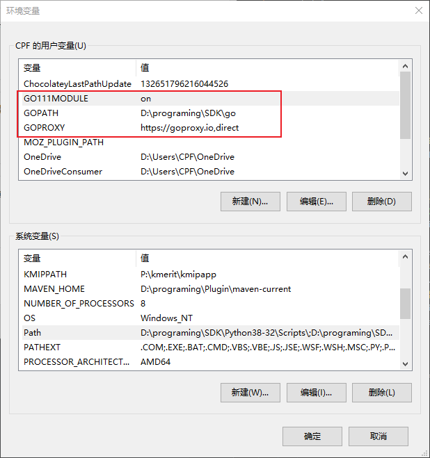

# golang

## 语言简介

google公司设计, 起源于 2007 年，并在 2009 年正式对外发布

旨在不损失应用程序性能的情况下降低代码的复杂性，具有“部署简单、并发性好、语言设计良好、执行性能好”等优势

它不但能让你访问底层操作系统，还提供了强大的网络编程和并发编程支持。Go语言的用途众多，可以进行网络编程、系统编程、并发编程、分布式编程。

通过接口（interface）的概念来实现多态性。Go语言有一个清晰易懂的轻量级类型系统，在类型之间也没有层级之说。因此可以说Go语言是一门混合型的语言。

很多重要的开源项目都是使用Go语言开发的，其中包括 Docker、Go-Ethereum、Thrraform 和 Kubernetes。

Go 是编译型语言, 是第一门完全支持 UTF-8 的编程语言

## go 命令

1. go get 加 -u 和不加 -u 参数的区别

   > 加上它可以利用网络来更新已有的代码包及其依赖包。如果已经下载过一个代码包，但是这个代码包又有更新了，那么这时候可以直接用 -u 标记来更新本地的对应的代码包。如果不加这个 -u 标记，执行 go get 一个已有的代码包，会发现命令什么都不执行。只有加了 -u 标记，命令会去执行 git pull 命令拉取最新的代码包的最新版本，下载并安装。


## vscode 配置go语言开发环境

参考自: <https://blog.csdn.net/mall_lucy/article/details/112920410>

1. 下载go 安装包, 并解压.
2. 将解压的go安装包的bin目录加到环境变量path中, 命令行查看版本是否正常显示.
   
   ```shell
   # 查询当前版本
   > go version
   go version go1.16.6 windows/amd64
   ```

3. 在用户环境变量下新建两个环境变量

   1. GO111MODULE: on
   2. GOPROXY: https://goproxy.io,direct

   

4. 打开vscode, 安装`go`插件
   
5. 新建一个go工程文件, vscode会自动弹出安装go插件的提示, 选择全部安装

## go 命令行命令


## 遍历汇总

遍历Map

```go
func main(){
    a := map[string]string{
        "alice":"11",
        "bob":"29",
        "zhangsan":"29",
        "wang":"35",
    }

    tmpRs := map[string][]string{}
    // 根据value，把Value相同的放在一起，结果放在一个大map里.
    for k1, v1 := range a {
        tmpRs[v1] = append(tmpRs[v1], k1)
    }
    
    fmt.Printf("tmpRs.........=%v",tmpRs)
}
```