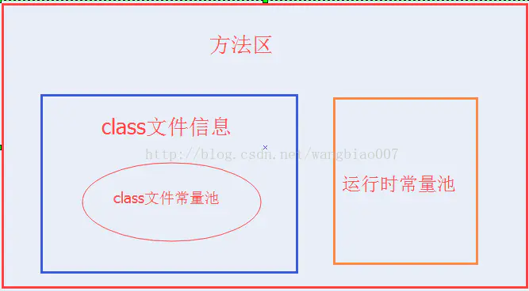
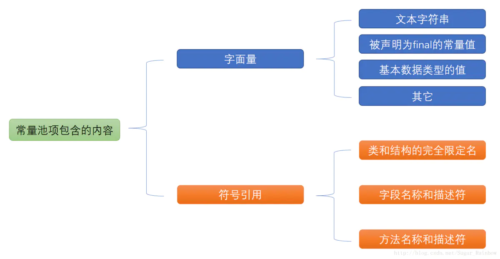

# 第 2 章 Java 虚拟机的结构

参考网址: <https://docs.oracle.com/javase/specs/jvms/se8/html/jvms-2.html>

## 数据类型

Java 虚拟机对两种类型进行操作：**原始类型** 和**引用类型**。相应地，有两种值可以存储在变量中、作为参数传递、由方法返回和操作：**原始值**和**引用值**。

**Java 虚拟机期望几乎所有类型检查都在运行时之前完成，通常由编译器完成，而不必由 Java 虚拟机本身完成。**
原始类型的值不需要被标记或以其他方式可检查以确定它们在运行时的类型，或与引用类型的值区分开来。

Java 虚拟机包含对对象的显式支持。**一个对象要么是一个动态分配的类实例，要么是一个数组**。对对象的引用被认为具有 Java 虚拟机类型 reference。类型的值 reference 可以被认为是指向对象的指针。可能存在多个对一个对象的引用。对象总是通过类型的值进行操作、传递和测试 reference。

### Primitive Types and Values

Java 虚拟机支持的基本数据类型是数值类型、布尔类型和 returnAddress 类型

- 数值类型包括整型和浮点类型。
- 布尔类型的值对真值 true 和 false 进行编码，默认值为 false。
- returnAddress 类型的值是指向 Java 虚拟机指令操作码的指针。在基元类型中，只有 returnAddress 类型与 Java 编程语言类型没有直接关联。

1. 数值类型(numeric types)
   - 整数类型
     byte 8 位 有符号二进制补码整数，默认值为 0
     short 16 位 有符号二进制补码整数，默认值为 0
     int 32 位 有符号二进制补码整数，默认值为 0
     long 64 位 有符号二进制补码整数，默认值为 0
     char 16 位 无符号整数、UTF-16 编码，默认为 null（'u0000'）
   - 浮点数类型
     float 32 位单精度（IEEE 754 标准）, 默认值为正零
     double 64 位单精度（IEEE 754 标准）, 默认值为正零
     > IEEE 754 标准不仅包括正号和负号幅度数字，还包括 `正数0`、`负数0`、`正无穷大`、`负无穷大`、`NaN`(Not-a-Number, 表示某些无效操作的结果，例如零除以零)
     > 除了 NaN 之外，其他值都是 有序的, 任何数字与 NaN 比较都会返回 false(NaN 和 NaN 比较同样返回 false)
2. boolean
   布尔类型的值对真值 true 和 false 进行编码，默认值为 false。
   在 Java 编程语言中对布尔值进行操作的表达式被编译为使用 Java Virtual Machine int 数据类型的值。
   在 Oracle 的 Java 虚拟机实现中，Java 编程语言中的布尔数组被编码为 Java 虚拟机字节数组，每个布尔元素使用 8 位。
3. returnAddress
   returnAddress 值指向虚拟机一个地址, 类型不对应于任何 Java 编程语言类型，并且不能被正在运行的程序修改。

### 参考类型及参考值(Reference Types and Values)

有三种引用类型: `类类型`、`数组类型`和`接口类型`。它们的值分别是对动态创建的类实例、数组或实现接口的类实例或数组的引用。

数组类型由具有单个维度的组件类型组成(其长度不是由类型给出的)。 数组类型的组件类型本身可以是数组类型。 如果从任何数组类型开始，考虑其组件类型，然后(如果也是数组类型)考虑该类型的组件类型，以此类推，最终必须到达非数组类型的组件类型; 这称为数组类型的元素类型。 数组类型的元素类型必然是基元类型、类类型或接口类型。

> 数据最外维是 组件类型，最里面维度称为 元素类型。如 List，其中 List 是组件类型，Integer 是元素类型。

引用值也可以是特殊的 null 引用，对 no 对象的引用，这里将用 null 表示。空引用最初没有运行时类型，但可以强制转换为任何类型。引用类型的默认值为空。

## 运行时数据区(Run-Time Data Areas)

Java 虚拟机定义了在程序执行期间使用的各种运行时数据区域。其中一些数据区域是在 Java 虚拟机启动时创建的，只有在 Java 虚拟机退出时才会销毁。其他数据区域为每个线程。每个线程的数据区域是在创建线程时创建的，并在线程退出时销毁。

1. pc 寄存器(pc register)
   每个 JVM 线程都有自己的 pc 寄存器
   每个线程只执行一个方法
   容量至少应当能保存一个 returnAddress 类型的数据或者一个与平台相关的本地指针的值

2. 虚拟机栈(VM stacks)
   每个线程都有一个专用的 Java 虚拟机堆栈，与线程同时创建。Java 虚拟机堆栈存储帧。Java 虚拟机堆栈类似于传统语言(如 c)的堆栈: 它保存局部变量和部分结果，并在方法调用和返回中发挥作用。因为 Java 虚拟机栈从来不会被直接操作，除了推送和弹出框架，框架可能会被分配到堆中。Java 虚拟机堆栈的内存不需要是连续的。
   下列异常情况与 Java 虚拟机堆栈相关

   - StackOverflowError 线程请求分配的栈容量超过 JVM 栈允许的最大容量
   - OutOfMemoryError 栈可以动态扩展，在尝试扩展时无法申请到足够的内存

3. 堆(heap)
   堆是 **虚拟机启动时创建的** **供各个线程共享的** **运行时数据区域**.
   从中分配所有类实例和数组的内存。对象的堆存储由自动存储管理系统(垃圾收集器)回收;
   堆的大小可以是固定的，也可以根据计算的需要进行扩展，如果不需要更大的堆，还可以进行收缩。堆的内存不需要是连续的。

   - OutOfMemoryError: 如果计算需要比自动存储管理系统所能提供的更多的堆，那么 Java 虚拟机将抛出 OutOfMemoryError 错误。

4. 方法区(method area)
   是可供各个线程共享的 运行时内存区域
   包括【 **运行时常量池**，**字段**和**方法数据**，**构造函数和普通方法的字节码内容**，**在类、实例、接口初始化时用到的特殊方法**】

   - OutOfMemoryError: 如果方法区域中的内存不能用于满足分配请求，则 Java 虚拟机抛出 OutOfMemoryError。

5. 运行时常量池(存放在方法区种)
   class 文件中每一个类或接口的常量池表
   OutOfMemoryError: 在创建类或接口时，如果运行时常量池的构造需要比 Java 虚拟机的方法区域可用的内存更多,则 Java 虚拟机抛出 OutOfMemoryError

6. 本地方法栈(native method stack)
   支持 native 的执行（其他语言编写的方法）
   - StackOverflowError: 如果线程中的计算需要比允许的更大的本机方法堆栈，那么 Java 虚拟机抛出一个 StackOverflowError。
   - OutOfMemoreyError: 如果本机方法堆栈可以动态扩展，本机方法堆栈扩展可以尝试，但是没有足够的内存可用，或者如果没有足够的内存可用来为新线程创建初始的本机方法堆栈，Java 虚拟机将抛出 OutOfMemoryError。

### 常量池

#### 字符串常量池

string pool在每个HotSpot VM的实例只有一份，被所有的类共享。
string pool中存的是引用值而不是具体的实例对象，字符串常量池是在本地内存当中，具体的实例对象是在堆中开辟的一块空间存放的, 在jdk1.8后，将String常量池放到了堆中。

#### class常量池

当java文件被编译成class文件之后，会在class文件中生成我们所说的class常量池，class文件中除了包含类的版本、字段、方法、接口等描述信息外，还有一项信息就是常量池(constant pool table)，用于存放编译器生成的各种字面量(文本字符串、被声明为final的常量、基本数据类型的值)和符号引用(类和接口的全限定名、字段的名称和描述符、方法的名称和描述符)。

#### 运行时常量池

运行时常量池是方法区的一部分，是一块内存区域。Class 文件常量池将在类加载后进入方法区的运行时常量池中存放。
运行时常量池也是每个类都有一个, 运行时常量池相对于 Class 文件常量池来说具备动态性，Class 文件常量只是一个静态存储结构，里面的引用都是符号引用。而运行时常量池可以在运行期间将符号引用解析为直接引用。可以说运行时常量池就是用来索引和查找字段和方法名称和描述符的。给定任意一个方法或字段的索引，通过这个索引最终可得到该方法或字段所属的类型信息和名称及描述符信息，这涉及到方法的调用和字段获取。

## 帧(Frames)

帧用于存储数据和部分结果，以及执行动态链接、方法返回值和分派异常。

每次调用方法时都会创建一个新的帧。当方法调用完成时，帧将被销毁，不管该完成是正常的还是突然的(它将引发未捕获的异常)。帧是从创建框架的线程的 Java 虚拟机堆栈中分配的。每个帧都有自己的局部变量数组、自己的操作数堆栈 ，以及对当前方法类的运行时常量池的引用。

在给定的控制线程中，只有一个帧(执行方法的帧)处于活动状态。这个帧称为当前帧，它的方法称为当前方法。定义当前方法的类是当前类。对局部变量和操作数堆栈的操作通常与当前帧有关。

为程序提供调试功能

### 局部变量

每个帧包含一个变量数组，称为其局部变量。帧的局部变量数组的长度在编译时确定，并以类或接口的二进制表示形式提供，同时提供与帧相关联的方法的代码。

索引访问

单个局部变量可以保存类型为 boolean、 byte、 char、 short、 int、 float、 reference 或 returnAddress 的值。一对局部变量可以保存 long 或 double 类型的值。

### 操作数栈(Operand Stacks)

每个帧包含一个后进先出(LIFO)堆栈，称为其操作数堆栈。帧的操作数堆栈的最大深度在编译时确定。

操作数堆栈上的每个条目都可以保存任何 Java 虚拟机类型的值，包括 long 类型或 double 类型的值。

操作数堆栈中的值必须以适合其类型的方式进行操作。

在任何时间点，操作数堆栈都有一个相关的深度，其中 long 或 double 类型的值为深度贡献两个单位，其他类型的值为深度贡献一个单位。

### 动态链接(Dynamic Linking)

每个帧包含对当前方法类型的运行时常量池的引用，以支持方法代码的动态链接。方法的类文件代码引用要调用的方法和要通过符号引用访问的变量。动态链接将这些符号方法引用转换为具体的方法引用，根据需要加载类以解析尚未定义的符号，并将变量访问转换为与这些变量的运行时位置相关联的存储结构中的适当偏移量。

### 正常方法调用完成(Normal Method Invocation Completion)

如果调用不会直接从 Java 虚拟机引发异常(2.10) ，或者由于执行显式抛出语句而引发异常，则方法调用正常完成。如果当前方法的调用正常完成，则可以将值返回给调用方法。当被调用的方法执行一条返回指令(2.11.8)时，就会发生这种情况，选择哪一条指令必须适合所返回值的类型(如果有的话)。

在这种情况下，使用当前帧(2.6)恢复调用程序的状态，包括其局部变量和操作数堆栈，调用程序的程序计数器适当地递增以跳过方法调用指令。然后在调用方法的框架中继续正常执行，将返回的值(如果有的话)推送到该框架的操作数堆栈上。

### 方法调用的突然完成(Abrupt Method Invocation Completion)

如果在方法中抛出异常，并且该异常没有在方法中处理，则方法调用会突然完成。会显式引发异常，如果当前方法没有捕获异常，则会导致突然的方法调用完成。突然完成的方法调用永远不会向其调用程序返回值。

### 帧其它相关

1. 浮点运算
   1. JVM 的浮点操作
      - 遇到被0除、上下限溢出和非精确时，不会抛出错误
      - 不支持 IEEE 754 的信号浮点比较
      - 舍入操作：向最接近数舍入模式，如果无法精确，则舍入到最低有效位为 0 的那个值
      - 浮点数值 -> 整型数值：向零舍入
      - 不支持 IEEE 754 的单精度扩展和双精度扩展格式
   2. 浮点模式
      - 每个方法都有这项属性
      - 分为 FP-strict 模式、非FP-strict模式
      - 体现在 class 文件的方法 method_info 结构的访问标志 access_flags 中的 ACC_STRICT 标志位
      - JDk 1.1以及之前版本的编译器是 非FP-strict模式
   3. 数值集合转换
      - 支持扩展指数集合的 JVM 实现数值在标准浮点数集合与扩展指数集合之间饿映射关系是允许或必要的
      - float => 单精度浮点数集合中的元素
      - double => 双精度浮点数集合中的元素
2. 特殊方法
   （1） 构造方法（初始化方法）
   （2）签名多态性
   由 java.lang.invoke.MethodHandle 类进行声明
   只有一个类型为 Object[] 的形参
   返回值为 Object
   ACC_VARARGS 和 ACC_NATIVE 标志被设置
3. 异常
   1. 同步异常
      athrow 字节码指令被执行
      虚拟机同步检测到程序发生非正常的执行情况
   2. 异步异常
      调用了 Thread 或者 ThreadGroup 的 stop 方法
      JVM 实现发生了内部错误
      每个执行的方法都配备0~多个异常处理器
4. 类库
   需要JVM特殊支持的类
   反射：java.lang.reflect、Class
   加载和创建类或接口的类：ClassLoader
   连接和初始化类或接口：ClassLoader
   安全：java.security
   多线程：Thread
   弱引用：java.lang.ref
5.  公有设计、私有实现
   == 统一设计、各自实现

## 对象的表示

在 Java 虚拟机的一些 Oracle 实现中，对类实例的引用是指向一个句柄的指针，
该句柄本身就是一对指针: 一个指向表示对象类型的 Class 对象的指针，另一个指向从堆中为对象数据分配的内存。

## 附录

### Java 虚拟机中的实际和计算类型

| 实际类型      | 计算类型      | Category |
| ------------- | ------------- | -------- |
| boolean       | int           | 1        |
| byte          | int           | 1        |
| char          | int           | 1        |
| short         | int           | 1        |
| int           | int           | 1        |
| float         | float         | 1        |
| reference     | reference     | 1        |
| returnAddress | returnAddress | 1        |
| long          | long          | 2        |
| double        | double        | 2        |
